# uma_bbnc_project 北斗UMA项目
Hi, welcome to view our implementation of ProjectX!

你好，欢迎了解“北斗UMA - ProjextX项目”！

> Our main contract: [**ProjectX.sol**](https://github.com/stellarkey/uma_bbnc_project/blob/main/Project%20X/contracts/ProjectX.sol).
>
> Our front-end code: [**websitedemo/**](https://github.com/stellarkey/uma_bbnc_project/tree/main/Project%20X/websitedemo).
>
> Our Demo website: [**http://donate.confluxcharity.xyz/**](http://donate.confluxcharity.xyz/).

# Conflux Charity 去中心化慈善系统

The traditional operating model of charities is highly prone to corruption, fraud, and misuse of funds; mainly due to the high number of intermediaries and the untraceable nature of cash.


[**Project X**](https://github.com/stellarkey/uma_bbnc_project) (**Conflux Charity**) solves this issue as a Conflux dApp platform which:
1) ensures transparency over the end-to-end flow of funds;
2) provides peer-to-peer donation option between donor and recipient;
3) enables customization on funds usability.

## Flowchart 流程设计

We designed a new flowchart to support our ideas on decentralized charity as dApp.


There are four basic role of participants in our initial design:

- `NPO`: Non-profitable Organization
- `Recipient`: personal account for anyone who needs help
- `Donor`: personal or some group account who wants to help others
- `Vendor`: suppliers who supply goods to make sure using the donation is properly

## Win-Win for Everyone 理想帕累托改进

Our ultimate goal is to bring a new era on charity, and everyone will benefit from it.


# Contract 后端设计

Our main contract: [**ProjectX.sol**](https://github.com/stellarkey/uma_bbnc_project/blob/main/Project%20X/contracts/ProjectX.sol).

## Functionality Overview 功能总览

The code is developed according to the flowchart we designed.


All the functions supporting is implemented in a single contract.

> Notice: Local deployment require manual setting on the gas limit(>10000000).
>
> 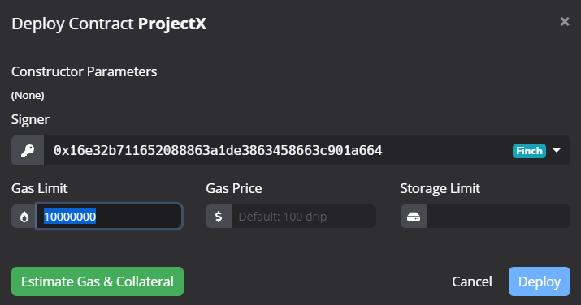

## Coding Details 代码细节

Our main contract:


### Initialization

We set *admin info*, *type info*, *staking info* and *sponsorship info* in the constructor.

```c
// initialization
constructor() {
    // admin settings
    project_admin = msg.sender;
    admin_donation_pool = 0;

    // type settings
    for(uint i = 1; i < type_list.length; i++){
        type_map[ type_list[i] ] = i;
    }

    // staking price initializaions
    staking_price["Recipient"] = 23 * 1e18;
    staking_price["NPO"] = 233 * 1e18;
    staking_price["Vendor"] = 666 * 1e18;
    staking_price["CrowdFund"] = 2333 * 1e18;

    // Whitelist sponsor settings
    SponsorWhitelistControl swc = SponsorWhitelistControl(0x0888000000000000000000000000000000000001); // Whitelist contract address
    address[] memory a = new address[](1);
    a[0] = 0x0000000000000000000000000000000000000000;  // sponsor for everyone
    swc.addPrivilege(a);
}
```

### Registration

Our project requires registration and validation before any form of partictpantion.

> `type_list = ["default", "Donor", "NPO", "Recipient", "CrowdFund", "Vendor"];`
>
> Index of the type in the correspond type_id.

Register as a `Donor` (type_id = `1`):

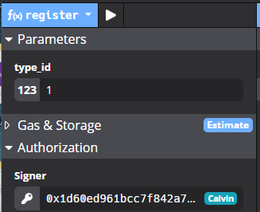

Register as a `Recipient` (type_id = `3`):

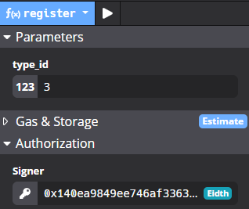

Everyone except Donors need to valide themself.

First, `stake`.

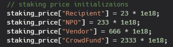

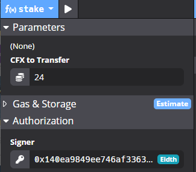

Second, `decribe` oneself:

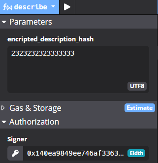

Finally, `validate`:

```c
// validate an address
function validate() public {
    require(!is_locked(msg.sender), "Locked address, can't be validated!");
    require(!is_valid(msg.sender), "Only invalid address can be validated!");
    require(staking_fund[msg.sender] != 0, "Need staking before validation.");
    require(descriptions[msg.sender] != bytes32(0x0), "Need description before validation.");

    // TODO: branches to be designed
    validations[msg.sender] = true;
}
```

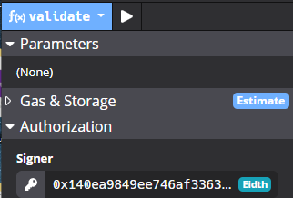

### Donation

`donate` to the contract pool:


`donate_to` as p2p donation:

```c
// Donor: p2p donation using CFX
function donate_to(address payable receiver) public payable {
    require(is_valid(msg.sender), "Invalid sender!");
    require(is_valid(receiver), "Invalid receiver!");

    require(types[receiver] != uint(0x0), "Unregistered receiver!");
    require(types[msg.sender] == type_map["Donor"], "Only donors can donate!");
    require(types[receiver] != type_map["Donor"], "Only NOT donors can be donated to!");
    require(types[receiver] != type_map["Vendor"], "Only NOT vendors can be donated to!");

    require(msg.value > 0, "Invalid donation!");

    // Seperate situations
    if(types[receiver] == type_map["Recipient"]){
        // support transferring directly from sender to receiver
        
        Recipient_donation_pool[receiver] += msg.value;
        //receiver.transfer(msg.value);
        donation_record[msg.sender] += msg.value;
    }
    else if(types[receiver] == type_map["NPO"]){
        NPO_donation_pool[receiver] += msg.value;
        donation_record[msg.sender] += msg.value;
    }
    else if(types[receiver] == type_map["CrowdFund"]){
        require(CrowdFund_donation_pool[receiver] < CrowdFund_donation_target[receiver], "Donation target completed!");
        uint256 lim = CrowdFund_donation_target[receiver] - CrowdFund_donation_pool[receiver];
        if(msg.value > lim){
            // refund the overflowed donations
            msg.sender.transfer(msg.value - lim);
            CrowdFund_donation_pool[receiver] = CrowdFund_donation_target[receiver];
            donation_record[msg.sender] += lim;
        } else{
            CrowdFund_donation_pool[receiver] += msg.value;
            donation_record[msg.sender] += msg.value;
        }
    }
    
}
```

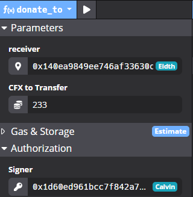

### Consumption

We support goods cosumption in the system.

`buy_goods`:

```c
// Buy all kinds of goods from vendors
function buy_goods(uint256 goods_number, uint quantity) public payable {
    require(is_valid(msg.sender), "Invalid sender!");
    require(types[msg.sender] == type_map["Recipient"] || types[msg.sender] == type_map["NPO"], "Only recipients and NPOs can buy goods from vendors!");
    require(goods_valid[goods_number], "Invalid goods.");

    if(types[msg.sender] == type_map["Recipient"]){
        require(Recipient_donation_pool[msg.sender] >= goods_price[goods_number] * quantity, "Not enough tokens.");

        Vendor_pool[ goods_providing_vendor[goods_number] ] += goods_price[goods_number] * quantity;
        // // refund the overflows
        //msg.sender.transfer(msg.value - goods_price[goods_number] * quantity);
        Recipient_donation_pool[msg.sender] -= goods_price[goods_number] * quantity;
    } else{
        require(NPO_donation_pool[msg.sender] >= goods_price[goods_number] * quantity, "Insuffcient NPO's donation pool.");
        
        Vendor_pool[ goods_providing_vendor[goods_number] ] += goods_price[goods_number] * quantity;
        
        NPO_donation_pool[msg.sender] -= goods_price[goods_number] * quantity;
    }

    // refund misprovided CFXs (if there are any)
    msg.sender.transfer(msg.value);
}
```

### Specified Functionality

As we mentioned in the overview.

NPOs can redistribe donations into recipients just like the flowchart has designed.

Vendors shall manage the goods.

The system offer vendors and recipients a way to withdraw their tokens. Because all the donations is running under the contract, and the contract is the only one holding the tokens for now.

> We can add safety mechanism through this, for instance we can `lock` one’s address to avoid `withdraw` in case bad behaviors happend.

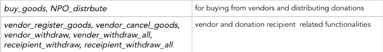

### Sponsorship

We support sponsorship in the contract.

`sponsor_gas` and `sponsor_collateral`. So the participants won’t pay for the transaction.

> We might need to add some safety mechanism in the future to avoid attacks like DDoS.

### View Funcitons

There are also some view-only functions to display the system parameters.

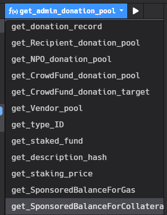

### Administration

We enable the administration management in the system for now, until we figured out a better safety insurance design.

```c
/// admin control
///
// Caution: amount's unit is Drip.
function set_staking_price(uint type_id, uint256 amount) public {
    require(msg.sender == project_admin, "Admin permission denied.");
    require(type_id > 0 && type_id < type_list.length, "Invalid type_id!");
    staking_price[type_list[type_id]] = amount;
}
// admin can lock adresses with suspicious behaviors
function lock_address(address a) public {
    require(msg.sender == project_admin, "Admin permission denied.");
    lock[a] = true;
    validations[a] = false;
}
function unlock(address a) public {
    require(msg.sender == project_admin, "Admin permission denied.");
    lock[a] = false;
}
function admin_distribute(address receiver, uint256 amount) public {
    require(msg.sender == project_admin, "Admin permission denied.");
    require(is_valid(receiver), "Invalid receiver!");
```

## Future Developing 可扩展性

Despite finished all the initial design of our project, we still have many ideas on the developing in the future.

> We also supported `Crowdfund` in the contract design because it’s becoming more and more trending.
>
> We designed `CouponCoin` for the future, cause we wanna introduce a couple system someday to make sure that specified donation is becoming coupons that can only be used in specified scenario or specified goods.

# Website 前端设计

Our front-end code: [**websitedemo**](https://github.com/stellarkey/uma_bbnc_project/tree/main/Project%20X/websitedemo).

Our Demo website: [**http://donate.confluxcharity.xyz/**](http://donate.confluxcharity.xyz/).

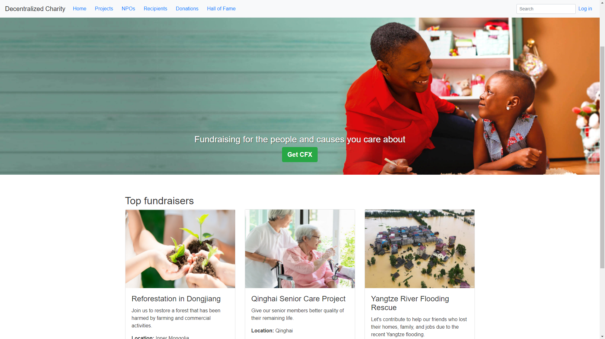

## Functionality Overview 功能总览

We deveploped a friendly user interface to enhance our project’s accesibility.

### Log In Interface

Our project need users to register and veify themself both on the website and also on the blockmain.

> We shall support full funcitonality with searching in the future development.

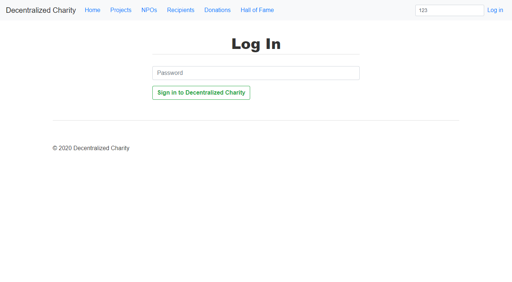

### Swapping Support Channel

In our initial design, we use a swaping market (providing an URL link as “Get CFX”) to supply a channel to those who aren’t very familiar with Conflux, and they could get CFXs from the swapping.

> This can be easily modified in the future, if we add some moonswap-like mechanism into our system. And through this kind of independant design, we can focus more on the effective part of functionality.


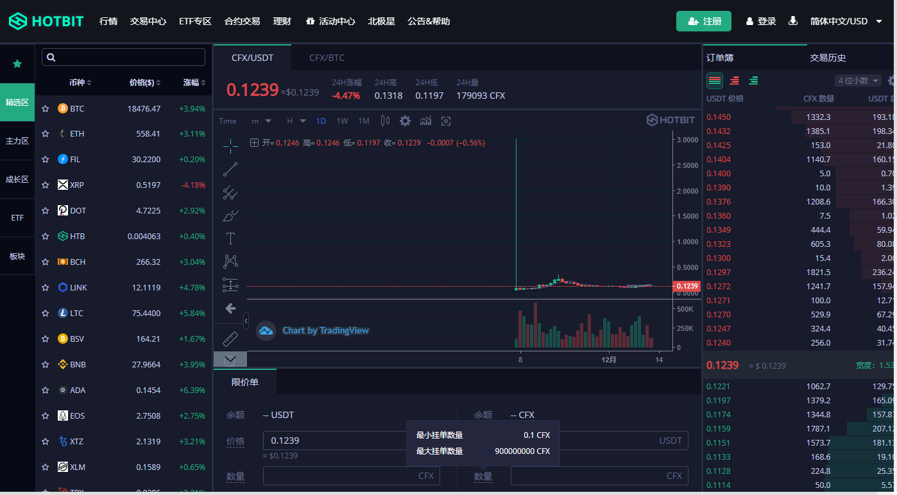

### Project Page

We have a `Projects` page to show all the `CrowdFund` donation states as we mentioned in the contract design part.

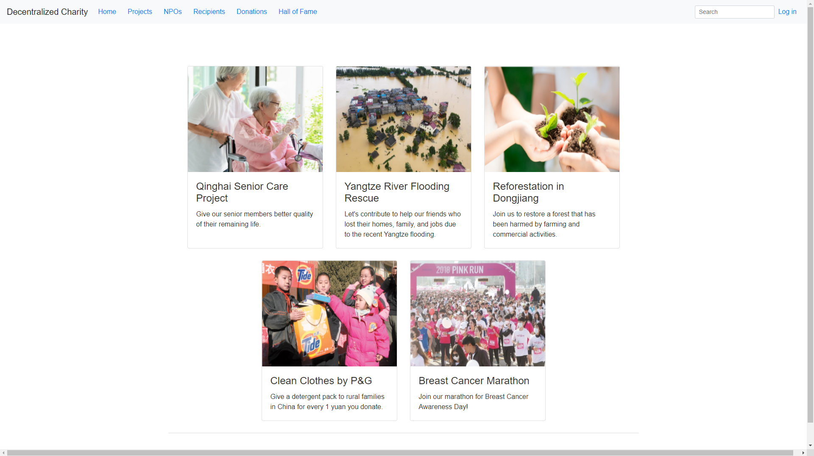

### NPOs Page

We have a `NPOs` page to show all the `NPO` organizations as we mentioned in the contract design part.

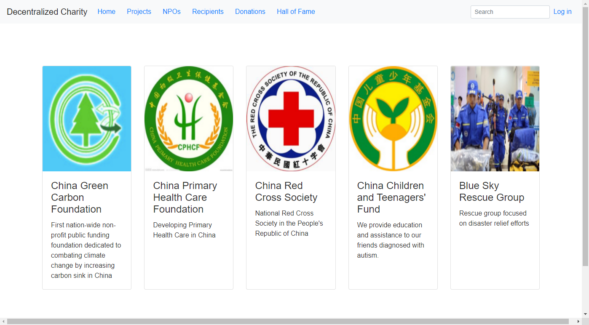

### Recipients Page

We have a `Recipients` page to show all the `Recipient` informations as we mentioned in the contract design part.

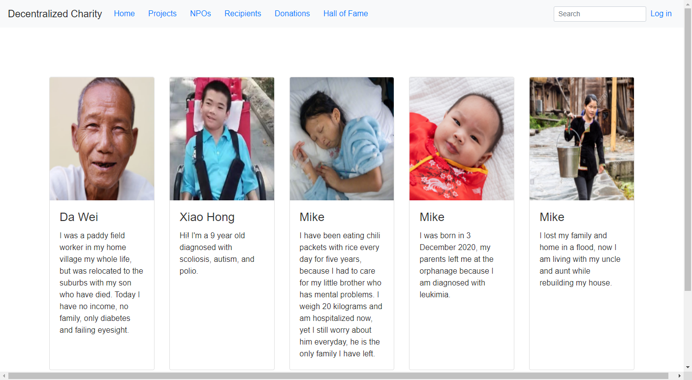

### Donations Page

We have a `Donations` page to show all the donation transactions on the blockchain as we mentioned in the contract design part.

Basic info: **Donor Name**，**Amount**，**Recipient Type**，**Date**，**To**，**Tx Id**.

> The transactions can be sorted by `Amount` or `Date`.

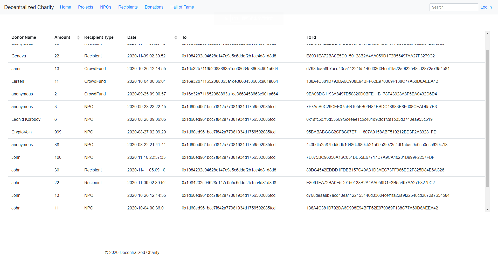

### Hall of Fame

We wanna develop a menchanism that can show statistics on the donations, and there will be a ranking system based on the statistics. And donors or NPOs with huge amout of donations can be broadcast from the `Hall of Fame` page to function as an incentive system to encourage the social environment keep growing. This part will be developed in the future.

## Local Deployment 本地操作

### Install packages

```
cd Project\ X/websitedemo/
npm install
```
### Run
```
npm run serve
```

