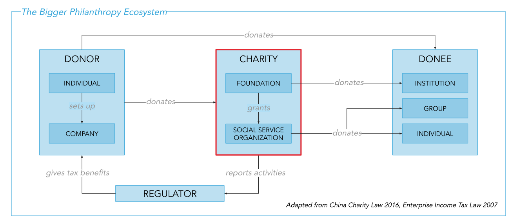
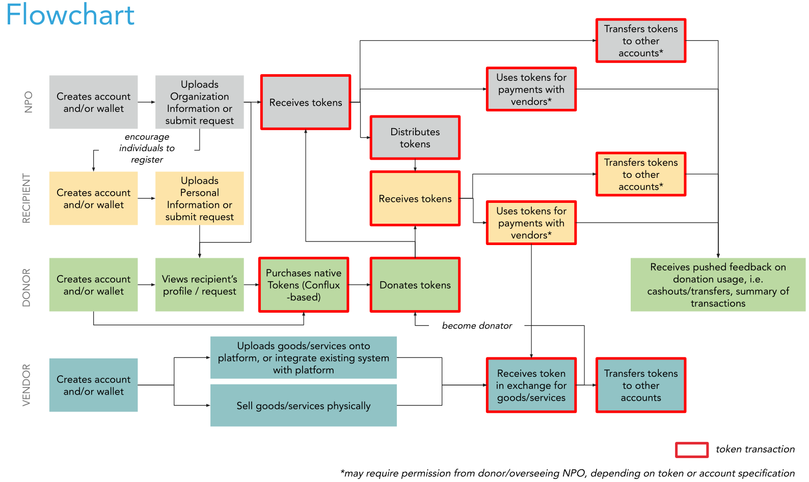
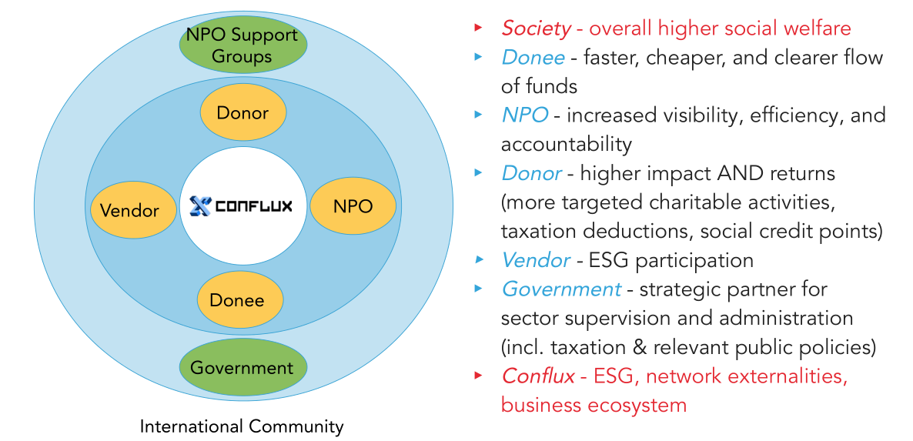
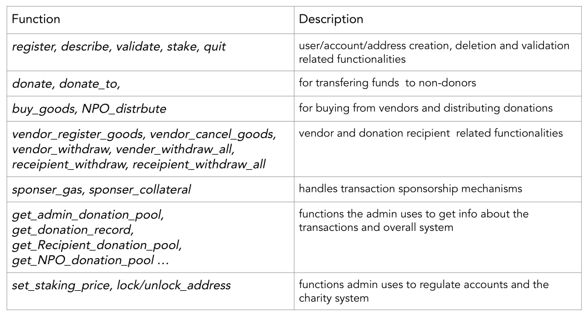
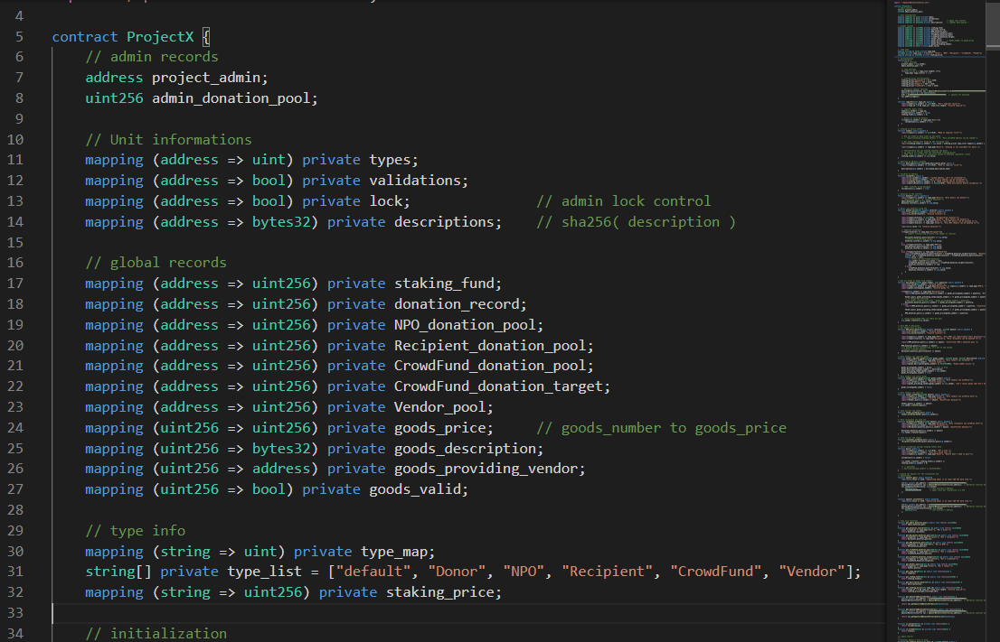

# uma_bbnc_project 北斗UMA项目
Hi, welcome to view our implementation of ProjectX!

你好，欢迎了解“北斗UMA - ProjextX项目”！

# Conflux Charity 去中心化慈善系统

The traditional operating model of charities is highly prone to corruption, fraud, and misuse of funds; mainly due to the high number of intermediaries and the untraceable nature of cash.



[**Project X**](https://github.com/stellarkey/uma_bbnc_project) (**Conflux Charity**) solves this issue as a Conflux dApp platform which:
1) ensures transparency over the end-to-end flow of funds;
2) provides peer-to-peer donation option between donor and recipient;
3) enables customization on funds usability.

## Flowchart 流程设计

We designed a new flowchart to support our ideas on decentralized charity as dApp.



There are four basic role of participants in our initial design:

- `NPO`: Non-profitable Organization
- `Recipient`: personal account for anyone who needs help
- `Donor`: personal or some group account who wants to help others
- `Vendor`: suppliers who supply goods to make sure using the donation is properly

## Win-Win for Everyone 理想帕累托改进

Our ultimate goal is to bring a new era on charity, and everyone will benefit from it.



# Contract 后端设计

The code is developed according to the flowchart we designed.



All the functions supporting is implemented in a single contract.

Our main contract:



Despite finished all the initial design of our project, we still have many ideas on the developing in the future.

> We also supported `Crowdfund` in the contract design because it’s becoming more and more trending.
>
> We designed `CouponCoin` for the future, cause we wanna introduce a couple system someday to make sure that specified donation is becoming coupons that can only be used in specified scenario or specified goods.

# Website 前端设计

our Demo website: [**http://donate.confluxcharity.xyz/**](http://donate.confluxcharity.xyz/)

## Install packages
```
cd Project\ X/websitedemo/
npm install
```
## Run
```
npm run serve
```

