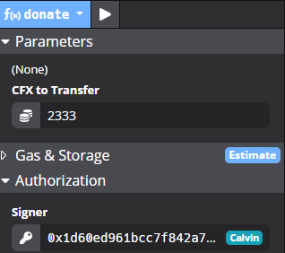

# uma_bbnc_project 北斗UMA项目
Hi, welcome to view our implementation of ProjectX!

你好，欢迎了解“北斗UMA - ProjextX项目”！

> Our main contract: [**ProjectX.sol**](https://github.com/stellarkey/uma_bbnc_project/blob/main/Project%20X/contracts/ProjectX.sol).
>
> Our front-end code: [**websitedemo/**](https://github.com/stellarkey/uma_bbnc_project/tree/main/Project%20X/websitedemo).
>
> Our Demo website: [**http://donate.confluxcharity.xyz/**](http://donate.confluxcharity.xyz/).

# Conflux Charity 去中心化慈善系统

The traditional operating model of charities is highly prone to corruption, fraud, and misuse of funds; mainly due to the high number of intermediaries and the untraceable nature of cash.


[**Project X**](https://github.com/stellarkey/uma_bbnc_project) (**Conflux Charity**) solves this issue as a Conflux dApp platform which:
1) ensures transparency over the end-to-end flow of funds;
2) provides peer-to-peer donation option between donor and recipient;
3) enables customization on funds usability.

## Flowchart 流程设计

We designed a new flowchart to support our ideas on decentralized charity as dApp.


There are four basic role of participants in our initial design:

- `NPO`: Non-profitable Organization
- `Recipient`: personal account for anyone who needs help
- `Donor`: personal or some group account who wants to help others
- `Vendor`: suppliers who supply goods to make sure using the donation is properly

## Win-Win for Everyone 理想帕累托改进

Our ultimate goal is to bring a new era on charity, and everyone will benefit from it.


# Contract 后端设计

Our main contract: [**ProjectX.sol**](https://github.com/stellarkey/uma_bbnc_project/blob/main/Project%20X/contracts/ProjectX.sol).

## Functionality Overview 功能总览

The code is developed according to the flowchart we designed.


All the functions supporting is implemented in a single contract.

> Notice: Local deployment require manual setting on the gas limit(>10000000).
>
> 

### Registration

Our project requires registration and validation before any form of partictpantion.

> `type_list = ["default", "Donor", "NPO", "Recipient", "CrowdFund", "Vendor"];`
>
> Index of the type in the correspond type_id.

Register as a `Donor` (type_id = `1`):


Register as a `Recipient` (type_id = `3`):


Everyone except Donors need to valide themself.

First, `stake`.


Second, `decribe` oneself:


Finally, `validate`:

```c
// validate an address
function validate() public {
    require(!is_locked(msg.sender), "Locked address, can't be validated!");
    require(!is_valid(msg.sender), "Only invalid address can be validated!");
    require(staking_fund[msg.sender] != 0, "Need staking before validation.");
    require(descriptions[msg.sender] != bytes32(0x0), "Need description before validation.");

    // TODO: branches to be designed
    validations[msg.sender] = true;
}
```


### Donation

`donate` to the contract pool:



`donate_to` as p2p donation:


### Consumption

### Specified Functionality

### Sponsorship

### View Funcitons

### Administration


## Coding Details 代码细节

Our main contract:


## Future Developing 可扩展性

Despite finished all the initial design of our project, we still have many ideas on the developing in the future.

> We also supported `Crowdfund` in the contract design because it’s becoming more and more trending.
>
> We designed `CouponCoin` for the future, cause we wanna introduce a couple system someday to make sure that specified donation is becoming coupons that can only be used in specified scenario or specified goods.

# Website 前端设计

Our front-end code: [**websitedemo**](https://github.com/stellarkey/uma_bbnc_project/tree/main/Project%20X/websitedemo).

Our Demo website: [**http://donate.confluxcharity.xyz/**](http://donate.confluxcharity.xyz/).


## Functionality Overview 功能总览

We deveploped a friendly user interface to enhance our project’s accesibility.

### Log In Interface

Our project need users to register and veify themself both on the website and also on the blockmain.

> We shall support full funcitonality with searching in the future development.


### Swapping Support Channel

In our initial design, we use a swaping market (providing an URL link as “Get CFX”) to supply a channel to those who aren’t very familiar with Conflux, and they could get CFXs from the swapping.

> This can be easily modified in the future, if we add some moonswap-like mechanism into our system. And through this kind of independant design, we can focus more on the effective part of functionality.


### Project Page

We have a `Projects` page to show all the `CrowdFund` donation states as we mentioned in the contract design part.


### NPOs Page

We have a `NPOs` page to show all the `NPO` organizations as we mentioned in the contract design part.


### Recipients Page

We have a `Recipients` page to show all the `Recipient` informations as we mentioned in the contract design part.


### Donations Page

We have a `Donations` page to show all the donation transactions on the blockchain as we mentioned in the contract design part.

Basic info: **Donor Name**，**Amount**，**Recipient Type**，**Date**，**To**，**Tx Id**.

> The transactions can be sorted by `Amount` or `Date`.


### Hall of Fame

We wanna develop a menchanism that can show statistics on the donations, and there will be a ranking system based on the statistics. And donors or NPOs with huge amout of donations can be broadcast from the `Hall of Fame` page to function as an incentive system to encourage the social environment keep growing. This part will be developed in the future.

## Local Deployment 本地操作

### Install packages

```
cd Project\ X/websitedemo/
npm install
```
### Run
```
npm run serve
```

